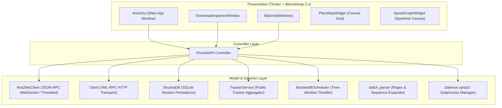

# Shusha Architecture & Technical Design

This document details the internal architecture, threading model, and subsystem relationships of **Shusha Download Manager**.

---

## 1. System Overview

Shusha is built on an **MVC (Model-View-Controller)** pattern designed for clean decoupling, testability, and responsiveness:

---

## 2. Subsystem Descriptions

### 2.1 Communication & Protocol Layer
- **`Aria2WsClient` (`src/shusha/models/ws_client.py`)**:
  - Implements a pure-Python RFC 6455 WebSocket framing client.
  - Connects to `ws://{host}:{port}/jsonrpc`.
  - Runs a dedicated background listener thread routing asynchronous push events (`aria2.onDownloadStart`, `aria2.onDownloadComplete`, etc.) directly to the UI without polling delay.
  - Automatically falls back to standard HTTP JSON-RPC POST when WebSockets are unavailable.
- **`Client` (`src/shusha/models/client.py`)**:
  - XML-RPC client wrapper with request timeout handling, method aliasing, and error serialization.
- **`Daemon` (`src/shusha/models/daemon.py`)**:
  - Manages `aria2c` process lifecycle, command-line argument building, PID file tracking, and session file persistence (`shusha.session`).

### 2.2 Domain Models & Persistence
- **`structs_downloads.py`**:
  - `Download`: Encapsulates download metadata, bitfield decoding (`pieces_bool_array`), ETA, speed formatting, and action delegates (`pause()`, `resume()`, `remove()`).
  - `File`: Individual file inside multi-file BitTorrent / Metalink archives.
  - `BitTorrent`: Torrent metadata, announce list, and info hash.
- **`structs_options.py`**:
  - Typed wrapper for 80+ aria2 options (`dir`, `split`, `max-connection-per-server`, `bt-tracker`, etc.).
- **`database.py`**:
  - SQLite transaction-safe database maintaining download history, custom tags, and queue persistence across app restarts.

### 2.3 Visual Components & High-DPI Assets
- **`svg_assets.py`**:
  - Dynamic vector asset generator producing crisp UI icons at any scale without raster pixelation.
- **`piece_map.py`**:
  - High-performance Tkinter `Canvas` grid rendering thousands of individual piece blocks color-coded by download status.
- **`speed_graph.py`**:
  - 60-second historical bandwidth sparkline and area chart tracking download and upload throughput.
